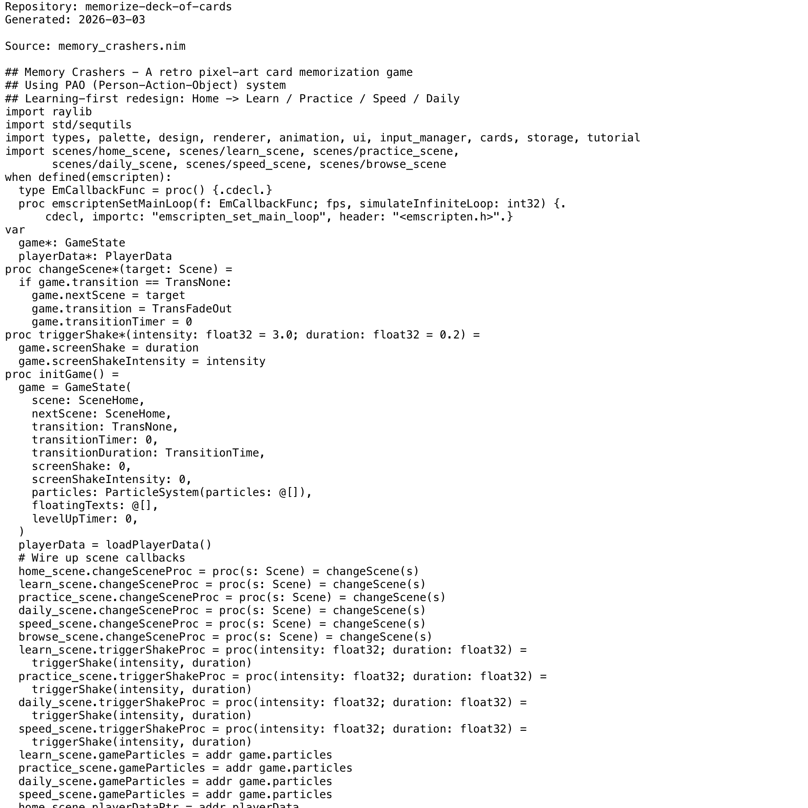

# Project Narrative & Proof

Generated: 2026-03-03

## User Journey
1. Discover the project value in the repository overview and launch instructions.
2. Run or open the build artifact for memorize-deck-of-cards and interact with the primary experience.
3. Observe output/behavior through the documented flow and visual/code evidence below.
4. Reuse or extend the project by following the repository structure and stack notes.

## Design Methodology
- Iterative implementation with working increments preserved in Git history.
- Show-don't-tell documentation style: direct assets and source excerpts instead of abstract claims.
- Traceability from concept to implementation through concrete files and modules.

## Progress
- Latest commit: 0fe3a2f (2026-02-21) - feat: feature expansion — browse scene, multi-deck, TAB reference, motivation text
- Total commits: 14
- Current status: repository has baseline narrative + proof documentation and CI doc validation.

## Tech Stack
- Detected stack: GitHub Actions, Nim, HTML/CSS

## Main Key Concepts
- Key module area: `src`

## What I'm Bringing to the Table
- End-to-end ownership: from concept framing to implementation and quality gates.
- Engineering rigor: repeatable workflows, versioned progress, and implementation-first evidence.
- Product clarity: user-centered framing with explicit journey and value articulation.

## Show Don't Tell: Screenshots


## Show Don't Tell: Code Excerpt
Source: `memory_crashers.nim`

```nim
## Memory Crashers - A retro pixel-art card memorization game
## Using PAO (Person-Action-Object) system
## Learning-first redesign: Home -> Learn / Practice / Speed / Daily
import raylib
import std/sequtils
import types, palette, design, renderer, animation, ui, input_manager, cards, storage, tutorial
import scenes/home_scene, scenes/learn_scene, scenes/practice_scene,
       scenes/daily_scene, scenes/speed_scene, scenes/browse_scene
when defined(emscripten):
  type EmCallbackFunc = proc() {.cdecl.}
  proc emscriptenSetMainLoop(f: EmCallbackFunc; fps, simulateInfiniteLoop: int32) {.
      cdecl, importc: "emscripten_set_main_loop", header: "<emscripten.h>".}
var
  game*: GameState
  playerData*: PlayerData
proc changeScene*(target: Scene) =
  if game.transition == TransNone:
    game.nextScene = target
    game.transition = TransFadeOut
    game.transitionTimer = 0
proc triggerShake*(intensity: float32 = 3.0; duration: float32 = 0.2) =
  game.screenShake = duration
  game.screenShakeIntensity = intensity
proc initGame() =
  game = GameState(
    scene: SceneHome,
    nextScene: SceneHome,
    transition: TransNone,
    transitionTimer: 0,
    transitionDuration: TransitionTime,
    screenShake: 0,
    screenShakeIntensity: 0,
    particles: ParticleSystem(particles: @[]),
    floatingTexts: @[],
    levelUpTimer: 0,
```
